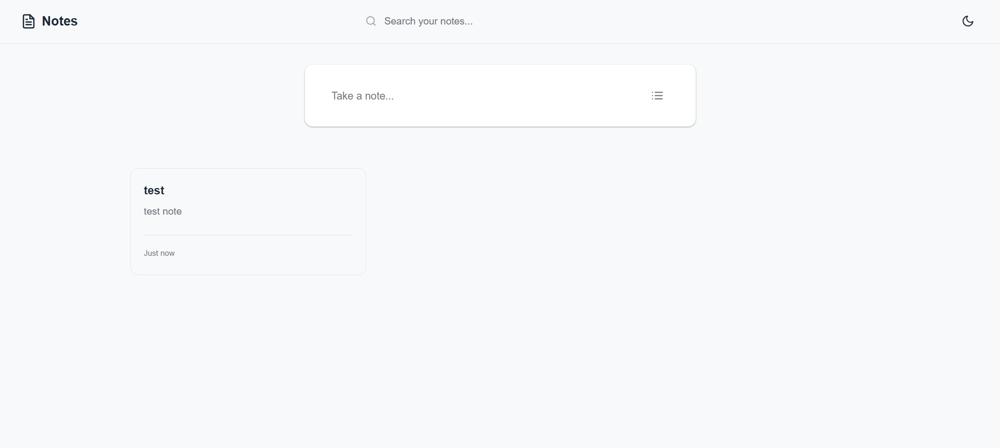
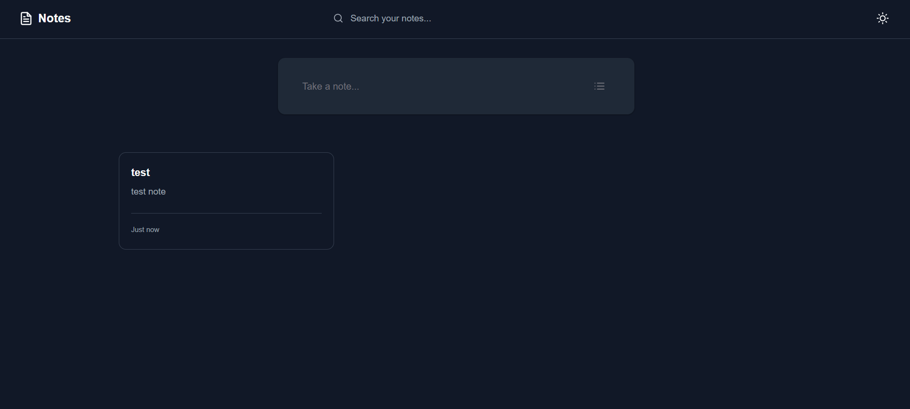

# 📝 React Note App - Google Keep Clone

یک اپلیکیشن یادداشت‌برداری مینیمال، مدرن و زیبا، ساخته شده با React و الهام گرفته از رابط کاربری تمیز Google Keep.


## ✨ ویژگی‌های کلیدی

- ✅ **ایجاد، ویرایش و حذف یادداشت‌ها (CRUD)**
- ✅ **رابط کاربری هوشمند:** فرم ایجاد یادداشت جمع‌شونده (Expandable) با انیمیشن روان
- ✅ **دارک مود (Dark/Light Theme):** پشتیبانی کامل از حالت تاریک و روشن با دکمه Toggle
- ✅ **شخصی‌سازی یادداشت‌ها:** امکان انتخاب رنگ پس‌زمینه اختصاصی برای هر یادداشت
- ✅ **جستجوی بلادرنگ (Real-time Search):** فیلتر سریع یادداشت‌ها بر اساس عنوان و متن
- ✅ **تاریخ‌های پویا (Dynamic Timestamps):** نمایش هوشمند زمان (مثلاً "Just now", "2 hours ago", "Oct 24")
- ✅ **ذخیره‌سازی پایدار:** ذخیره خودکار یادداشت‌ها و تنظیمات تم در Local Storage
- ✅ **کاملاً Responsive:** نمایش شبکه‌ای (Grid) عالی در موبایل، تبلت و دسکتاپ

## 📸 اسکرین‌شات‌ها

*(لینک تصاویر خود را در اینجا جایگزین کنید)*

### حالت روشن (Light Mode)


### حالت تاریک (Dark Mode)


## 🚀 راه‌اندازی پروژه (Quick Start)

این پروژه با استفاده از **Vite** و **React** توسعه داده شده است. برای اجرای آن در سیستم خود مراحل زیر را دنبال کنید:

```bash
# 1. Clone کردن پروژه
git clone https://github.com/AliNematt/Note-App.git

# 2. ورود به پوشه پروژه
cd Note-App

# 3. نصب وابستگی‌ها (Dependencies)
npm install

# 4. اجرای سرور توسعه (Development Server)
npm run dev
```
> پس از اجرای دستور آخر، پروژه در آدرس `http://localhost:5173` در مرورگر شما در دسترس خواهد بود.

## 🎨 معماری UI/UX و طراحی

- **Minimalist Design**: طراحی به شدت تمیز و بدون حاشیه با تمرکز بر محتوا
- **CSS Variables**: پیاده‌سازی اصولی سیستم مدیریت تم (Theme Management)
- **Interactive States**: افکت‌های Hover و Focus ملایم برای دکمه‌ها و فیلدهای ورودی
- **CSS Grid/Flexbox**: چینش واکنش‌گرای کارت‌ها و ابزارها
- **Typography**: استفاده از فونت مدرن **Inter** برای خوانایی بالا در زبان انگلیسی
- **SVG Icons**: استفاده از آیکون‌های وکتور و سبک به جای تصاویر سنگین

## 🛠️ تکنولوژی‌های استفاده شده

- **Core**: React 18, Vite
- **State Management**: React Hooks (`useState`, `useEffect`)
- **Styling**: Vanilla CSS3 (بدون کتابخانه جانبی برای کنترل کامل روی استایل‌ها)
- **Data Persistence**: Browser Local Storage API

## 🌟 ویژگی‌های پیشرفته فنی

- **مدیریت State پیچیده**: هندل کردن آبجکت‌ها و آرایه‌ها در ری‌اکت به صورت ایمن (Immutability).
- **Conditional Styling**: ترکیب هوشمندانه متغیرهای CSS با Inline-styles برای اعمال رنگ‌های انتخابی کاربر روی کارت‌ها بدون تداخل با دارک مود.
- **الگوریتم‌های پردازش زمان**: توابع سفارشی برای محاسبه اختلاف زمان ایجاد یادداشت با زمان حال و فرمت‌دهی متنی آن.
- **Event Handling**: مدیریت رویدادهای کیبورد (مثل زدن کلید `Enter` برای ثبت سریع یادداشت).

## 🤝 مشارکت

1. ریپازیتوری را Fork کنید
2. یک Branch جدید بسازید (`git checkout -b feature/AmazingFeature`)
3. تغییرات خود را Commit کنید (`git commit -m 'Add some AmazingFeature'`)
4. روی Branch خود Push کنید (`git push origin feature/AmazingFeature`)
5. یک Pull Request باز کنید

## 📝 لایسنس

این پروژه تحت لایسنس MIT منتشر شده است و استفاده از آن برای همه آزاد است.

## 👨‍💻 توسعه‌دهنده

**Ali Nemat**

- GitHub: [@AliNematt](https://github.com/AliNematt)
- Email: alinemat.webdesign@gmail.com
- Website: [alinemat.ir](https://alinemat.ir)

## 🙏 تشکر و تقدیر

- رابط کاربری الهام گرفته از سادگی و کارایی **Google Keep**.
- در توسعه استایل و ظاهر این برنامه و نگارش این README از هوش مصنوعی (مدل Gemini) کمک گرفته شده است.

---
⭐ اگر این اپلیکیشن یادداشت‌برداری برای شما مفید بود، دادن یک Star ⭐️ به این ریپازیتوری باعث خوشحالی من است!